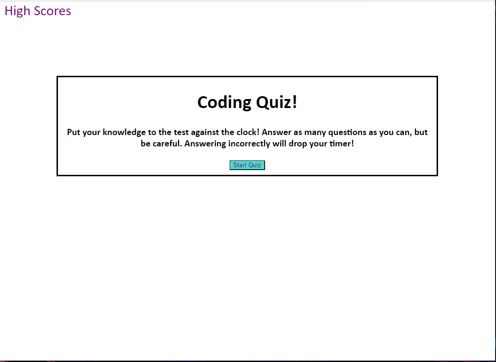
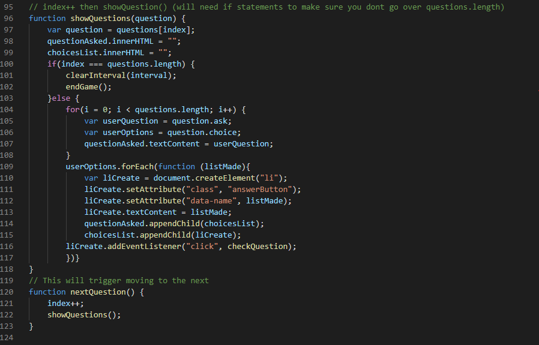

# Code Quiz!

## In this project I was given the tall task of building a coding quiz from scratch using HTML. CSS, and Javascript! I started in the same spot as all projects should..Pseudocode! I explained what I wanted to do, how I would do it and lastly why. So again I worked through all challenges and put together a quiz that will function properly and even give you a chance to keep track of high scores. I am pleased that I pushed myself to the end no matter what speed bumps came up in the process.

## Technology I Put to Work
- GitHub - repository storage for the project in order to amke changes, deploy them and push to a main branch. 

- GitBash - used for written commands and communicating witht he repository stored on GitHub.

- HTML - used to create and edit electronic documents stored on the web.

- Javascript - a programming language used to create specific events and make your website pop to viewers.
    - Functions
    - For Loops
    - Local Storage
    - Conditional Statements
    - Web API's 
        - Setting Attributes
        - Creating Elements
        - Appending Elements
        - Adding Event Listeners

## Site Preview

## How it was made! 
``Javascript

